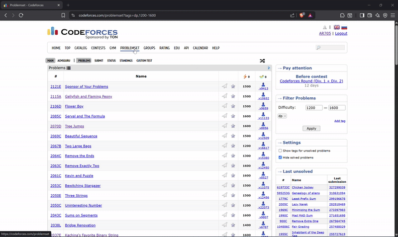

# Codeforces Problem Picker Extension
<p align="left">
    
    <a href="https://opensource.org/licenses/MIT"></a>
</p>

A Chrome extension that picks a random problem from the current [Codeforces](https://codeforces.com) problemset with one click.

<div align="center">
  
</div>

## Installation

Clone the project

```bash
  git clone https://github.com/AdhamElRouby/Codeforces-Problem-Picker.git
```

Go to the project directory

```bash
  cd .\Codeforces-Problem-Picker
```

Open with VSCode

```bash
  code .
```

Install dependencies

```bash
  npm install
```

Build the extension

```bash
  npm run build
```

Load the extension in Chrome

1. Go to `chrome://extensions/`
2. Enable "Developer mode"
3. Click "Load unpacked"
4. Select the `dist` folder from this project

## Usage

1. Visit the [Codeforces Problemset](https://codeforces.com/problemset) page and apply any filters or tags you like.
2. A `Pick One` button will automatically appear in the top-right corner above the problem list.
3. Click the button to open a random problem in a new tab, and enjoy solving!

## Privacy Policy

This extension operates only on the `codeforces.com/problemset` webpage. It requires host permission solely to automatically inject a "Pick One" button and interact with the problemset table on that page.

**The extension does not collect, store, or transmit any personal or sensitive user data.** It also does not monitor user activity, track browsing history, or access any content beyond the specified Codeforces page.

The developer does not sell or transfer user data to third parties, nor is any data used for purposes unrelated to the extension’s single function.

This extension fully complies with the [Chrome Developer Program Policies](https://developer.chrome.com/docs/webstore/program-policies).


## Contributing

I welcome contributions to this project! Feel free to submit pull requests and suggest improvements.
If you have any questions or need assistance, don't hesitate to contact me at [adhamelrouby@aucegypt.edu](mailto:adhamelrouby@aucegypt.edu).

## License

This project is licensed under the [MIT License](LICENSE).
